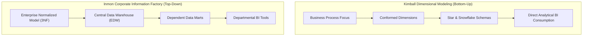

# Chapter 2: Literature Review and Theoretical Framework

**Author:** S M HOSNEY ARAFAT RIZON (Student ID: K2554665)  
**Programme:** MSc Information Systems  
**Module:** Project Dissertation (CI7000)  
**Supervisor:** Dr. Islam Choudhury  

---

## 2.1 Theoretical Foundations of Data Warehousing
The foundational architecture of analytical data management is characterized by a classical methodological divergence between two competing paradigms:

### 2.1.1 The Kimball Dimensional Modeling Approach
Kimball and Ross (2013) advocate a bottom-up, business-process-oriented architecture centered on dimensional modeling. Under this approach, operational transactions are denormalized into fact tables containing quantitative numerical measurements, surrounded by conformed dimension tables that encapsulate context (e.g., date, customer, product). The principal advantages of the Kimball methodology include:
1. **Query Simplicity:** Analysts and SQL-based BI engines can construct queries with straightforward equi-joins between facts and dimension tables.
2. **Aggregated Query Performance:** Denormalized star schemas eliminate deep recursive joins across relational hierarchies, maximizing database caching and index efficiency.
3. **Agile Incremental Delivery:** Individual business processes (e.g., sales, inventory) can be modeled and deployed in modular iterations using the Enterprise Data Warehouse Bus Architecture.

### 2.1.2 The Inmon Corporate Information Factory (CIF) Approach
Inmon (2005) proposes a top-down, enterprise-wide normalized paradigm. In this architecture, all operational data is ingested into an enterprise-wide normalized (3rd Normal Form) relational repository, serving as the single version of truth. Departmental data marts are subsequently created as downstream projections. While Inmon's normalized approach eliminates data redundancy and update anomalies, it introduces significant schema complexity and computational overhead for ad-hoc analytical queries across multiple business domains.

### 2.1.3 Hybrid & Data Vault 2.0 Paradigms
To address the rigidity of pure Inmon architectures and the maintenance overhead of pure Kimball denormalization, Linstedt and Olschimke (2015) introduced Data Vault 2.0. By decoupling business keys (Hubs), structural relationships (Links), and descriptive attributes (Satellites), Data Vault provides an auditable, agile staging layer. However, for SME environments where engineering simplicity and low latency are paramount, the Kimball dimensional model remains the dominant and most cost-effective standard.

---

## 2.2 Streaming Architectures: Lambda vs. Kappa
The exponential growth of event streams necessitated a shift from batch ETL to unified streaming analytics.

| Feature / Dimension | Lambda Architecture (Marz & Warren, 2015) | Kappa Architecture (Kreps, 2014) |
| :--- | :--- | :--- |
| **Core Concept** | Dual pipelines: Batch Layer (Hadoop/Spark) + Speed Layer (Storm/Flink) | Single unified streaming log pipeline (Apache Kafka) |
| **Codebase Overhead** | High (Dual implementations of transformation logic) | Low (Single streaming codebase for all data) |
| **Data Reprocessing** | Re-computes historical views via batch master dataset | Replays event log from immutable Kafka topics |
| **Operational Complexity**| Complex synchronization between batch and real-time views | Simpler operations, requires resilient stream storage |
| **Target Latency** | Seconds to Minutes (Unified at serving layer) | Sub-second real-time streaming |

Kleppmann (2017) argues that treating the immutable log as the central architectural primitive (Change Data Capture / Event Sourcing) enables auditability, replayability, and decoupled data propagation across modern analytical systems.

---

## 2.3 Columnar Storage and Modern OLAP Engines
Traditional Row-Oriented Relational Database Management Systems (RDBMS) store entire tuples contiguously on disk. While optimal for On-Line Transaction Processing (OLTP) involving row-level insertions and point lookups, they incur severe disk I/O bottlenecks when executing aggregate analytical queries across millions of rows (Abadi et al., 2008).

Modern Columnar Online Analytical Processing (OLAP) engines (e.g., Apache Druid, ClickHouse, DuckDB) achieve $5\times\text{ to }50\times$ query acceleration through:
1. **Columnar Projection:** Only the specific attributes referenced in the `SELECT` and `WHERE` clauses are read from disk.
2. **Vectorized Query Execution:** SIMD CPU instructions process arrays of columnar values simultaneously in L1/L2 cache.
3. **Advanced Compression:** Column-specific encodings (Run-Length Encoding, Delta, Dictionary, Roaring Bitmaps) achieve high compression ratios.

---

## 2.4 Data Quality, Lineage, and Governance
According to Redman (1998), poor data quality costs organizations between 15% and 25% of annual revenue through rework, flawed strategic decisions, and customer attrition. In modern analytics engineering, declarative testing frameworks (dbt Labs, 2020; Shaneck & Krishnamurthy, 2019) integrate automated assertions into CI/CD pipelines, validating uniqueness, referential integrity, and value ranges prior to exposing data to BI consumers.

---

## 2.5 Security, Privacy, and GDPR Compliance
The General Data Protection Regulation (GDPR, EU 2016/679) mandates strict legal obligations regarding the processing of personal data:
* **Article 25 (Data Protection by Design and by Default):** Privacy controls must be architecturally integrated from the ground up.
* **Article 32 (Security of Processing):** Organizations must implement pseudonymisation and encryption of sensitive fields.
* **Article 17 (Right to Erasure / 'Forgotten'):** Systems must support the permanent erasure or anonymisation of personal identifiers upon request without corrupting historical aggregate metrics.

---

## 2.6 Identification of the Research Gap
While the existing literature provides deep theoretical insights into individual components (dimensional modeling, streaming protocols, columnar OLAP engines, and GDPR compliance), there is a distinct lack of published empirical reference architectures that synthesize these elements into a single, cohesive, open-source platform evaluated under SME operational constraints. This dissertation directly addresses this gap.
