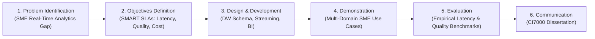

# Chapter 3: Research Methodology

**Author:** S M HOSNEY ARAFAT RIZON (Student ID: K2554665)  
**Programme:** MSc Information Systems  
**Module:** Project Dissertation (CI7000)  
**Supervisor:** Dr. Islam Choudhury  

---

## 3.1 Design Science Research (DSR) Framework
This research adopts the **Design Science Research (DSR)** paradigm formulated by Hevner et al. (2004) and refined by Peffers et al. (2007). DSR is an established methodological framework in Information Systems (IS) research that focuses on the creation and evaluation of innovative IT artifacts designed to solve identified business problems.

### Application of Hevner’s Seven Guidelines

| DSR Guideline | Implementation in this Research Project |
| :--- | :--- |
| **Guideline 1: Design as an Artifact** | Construction of an open-source, reproducible real-time Data Warehouse and BI platform. |
| **Guideline 2: Problem Relevance** | Resolving the real-time analytics and high-latency reporting barriers faced by resource-constrained SMEs. |
| **Guideline 3: Design Evaluation** | Quantitative empirical benchmarking of query response times, throughput, and automated data quality validation. |
| **Guideline 4: Research Contributions** | Delivering a validated hybrid reference architecture and empirical performance dataset. |
| **Guideline 5: Research Rigor** | Grounded in Kimball dimensional modeling, DSR evaluation methods, and GDPR Article 25/32 privacy-by-design standards. |
| **Guideline 6: Design as a Search Process** | Iterative engineering and refinement across 6 structured project phases. |
| **Guideline 7: Communication of Research** | Presentation of the complete dissertation, technical documentation, and open-source GitHub codebase. |

---

## 3.2 Data Generation and Sampling Strategy
To ensure empirical validity and strict ethical compliance, the experimental evaluation utilizes a dual data strategy:
1. **Deterministic Synthetic SME Dataset:** Generated using Python and JavaScript engines with cryptographic pseudo-random number generators seeded deterministically (`SEED = 42`). The dataset simulates 3 years of multi-domain enterprise transactions ($30{,}000+$ sales orders, $2{,}880+$ daily inventory snapshots, $10{,}000+$ general ledger postings, and monthly workforce records).
2. **Benchmark Query Workloads:** Standard analytical queries modeling real-world OLAP workloads (aggregations, drill-downs, multi-table joins, and temporal rollups).

---

## 3.3 Evaluation Metrics and Experimental Setup
The performance of the artifact is evaluated using four quantitative metrics:
1. **Query Response Latency:** Measured at the 50th (P50), 90th (P90), 95th (P95), and 99th (P99) percentiles over repeated executions.
2. **Streaming Ingestion Latency:** Calculated as $L = T_{\text{ingested}} - T_{\text{emitted}}$ in milliseconds.
3. **Data Quality Acceptance Rate:** Quantified as:
   $$\text{Acceptance Rate (\%)} = \left(\frac{N_{\text{total}} - N_{\text{rejected}}}{N_{\text{total}}}\right) \times 100$$
4. **Usability and Decision Support Utility:** Evaluated through multi-role BI dashboards implementing Role-Based Access Control (RBAC).

---

## 3.4 Ethical Considerations and GDPR Protocol
* **Data Minimization:** No personal data from real individuals was harvested or processed.
* **Pseudonymisation:** Synthetic customer identifiers were salted and hashed using SHA-256 (`Client_Hash_...`).
* **HR Data Protection:** Employee records were aggregated to departmental summaries to mitigate surveillance risks.
* **Licensing & Academic Integrity:** All underlying software libraries are open-source (Apache 2.0 / MIT).
