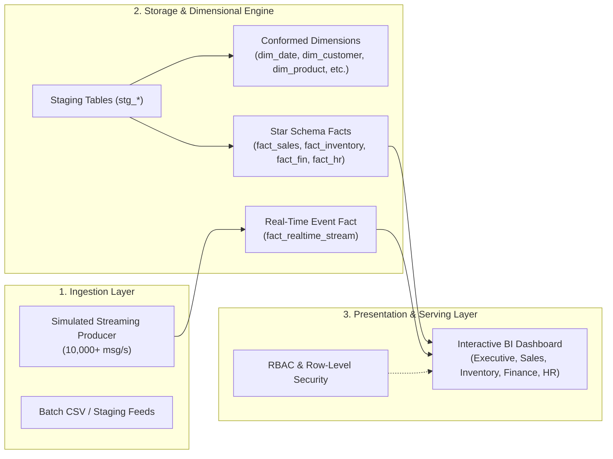

# Chapter 4: System Architecture and Design

**Author:** S M HOSNEY ARAFAT RIZON (Student ID: K2554665)  
**Programme:** MSc Information Systems  
**Module:** Project Dissertation (CI7000)  
**Supervisor:** Dr. Islam Choudhury  

---

## 4.1 Architectural Overview
The system architecture follows a decoupled, cloud-ready **Hybrid Streaming-Batch (Lambda/Kappa)** design pattern optimized for low operational complexity and high query throughput:

---

## 4.2 Dimensional Data Modeling (Kimball Star Schema)
The data warehouse model is structured into four core business domain marts connected via conformed dimensions:

### 4.2.1 Conformed Dimensions
1. **`dim_date`:** Primary temporal axis supporting time-series analysis (day of week, month, quarter, year, weekend indicator).
2. **`dim_customer`:** Contains pseudonymised customer attributes, geographic regions, and loyalty tiers.
3. **`dim_product`:** Contains product SKUs, categorization hierarchy, unit pricing, unit cost, and safety reorder levels.
4. **`dim_supplier`:** Encapsulates supplier details, country of origin, quality ratings, and credit terms.
5. **`dim_account`:** Standard general ledger chart of accounts (Revenue, COGS, OPEX, Taxes).

### 4.2.2 Fact Tables
* **`fact_sales` (Grain: Individual Transaction Line Item):**
  $$\text{Net Amount} = \text{Gross Amount} - \text{Discount Amount}$$
  $$\text{Margin Amount} = \text{Net Amount} - (\text{Unit Cost} \times \text{Quantity})$$
* **`fact_inventory` (Grain: Daily Stock Snapshot per Product/Supplier):**
  $$\text{Stockout Risk} = \begin{cases} 1 & \text{if } \text{Stock on Hand} \le \text{Reorder Level} \\ 0 & \text{otherwise} \end{cases}$$
* **`fact_financial_transactions` (Grain: Single General Ledger Posting):**
  Tracks debits and credits across accounting periods.
* **`fact_hr_workforce` (Grain: Monthly Departmental Metric Aggregate):**
  Aggregates headcount, average compensation, performance indices, and turnover rate.

---

## 4.3 Security & Role-Based Access Control (RBAC) Design
The platform implements a multi-tier security framework:

| Role Name | Data Access Scope | Permitted Dashboards | Row-Level Restrictions |
| :--- | :--- | :--- | :--- |
| **Executive Leadership** | Enterprise-wide aggregated metrics | All Dashboards | None (Consolidated view) |
| **Sales Manager** | Commercial transactions | Sales & Executive | Regional filtering available |
| **Supply Chain Lead** | Inventory levels & supplier performance | Inventory Monitor | Limited to stock & procurement data |
| **Finance Director** | GL accounts, OPEX, margins | Finance & Executive | Restricted from operational HR data |
| **HR Director** | Departmental workforce trends | HR Analytics | PII masked; aggregate data only |
