# Chapter 6: Evaluation, Benchmarking, and Results

**Author:** S M HOSNEY ARAFAT RIZON (Student ID: K2554665)  
**Programme:** MSc Information Systems  
**Module:** Project Dissertation (CI7000)  
**Supervisor:** Dr. Islam Choudhury  

---

## 6.1 Empirical Evaluation Overview
In accordance with Design Science Research (DSR) Guideline 3 (*Design Evaluation*), the implemented data warehouse and BI platform was subjected to rigorous empirical evaluation across three core dimensions:
1. **Computational Performance & Latency:** Evaluating query execution speed, buffer cache efficiency, and throughput across three optimization tiers on a live managed cloud instance (**Aiven Cloud PostgreSQL 17.11**).
2. **Data Pipeline & Streaming Reliability:** Measuring event streaming ingestion latency ($<2{,}000\text{ms}$ SLA) and automated row acceptance rates ($>99\%$ SLA).
3. **Decision Support Utility & Usability:** Conducting formal User Acceptance Testing (UAT) using the standardized System Usability Scale (SUS) across five representative business user personas.

---

## 6.2 SLA Target Verification Matrix

| Research Objective | Stated SLA Target | Empirical System Measurement | Evaluation Status |
| :--- | :--- | :--- | :---: |
| **O2: Batch ETL Quality** | Process $\ge 500{,}000$ rows with $>99\%$ acceptance | **99.92% Row Acceptance Rate** (0 critical failures) | **✅ PASSED** |
| **O3: Streaming Latency** | Throughput $\ge 10{,}000$ msg/s, Latency $<2{,}000$ ms | **P95 Latency: 140.0 ms** (Avg: 73.5 ms) | **✅ PASSED** |
| **O4: Analytical Query SLA** | 95th Percentile Query Latency $< 500$ ms | **P95: 15.63 ms** (Max: 134.5 ms on Cloud) | **✅ PASSED** |
| **O5: Multi-Domain BI Views** | Multi-domain interactive decision support | **6 Interactive BI Views** with dynamic RBAC & RLS | **✅ PASSED** |
| **O6: Usability & Satisfaction** | Average SUS Usability Score $\ge 70 / 100$ | **83.5 / 100 (Grade A — Excellent Usability)** | **✅ PASSED** |

---

## 6.3 Comparative Multi-Tier Query Performance Experiment
To evaluate the quantitative benefit of Kimball dimensional modeling and pre-aggregated serving layers over standard normalized staging structures, an empirical multi-tier benchmark was conducted on **PostgreSQL 17.11**.

```mermaid
gantt
    title Query Latency Comparison: Baseline vs. Star Schema vs. Materialized Views (ms)
    dateFormat X
    axisFormat %s ms
    section Monthly Rollup
    Tier 1 Unindexed Staging (118.8ms) : 0, 119
    Tier 2 Kimball Star Schema (50.7ms) : 0, 51
    Tier 3 Materialized View (1.5ms)   : 0, 2
    section Regional Drill-Down
    Tier 1 Unindexed Staging (25.5ms)  : 0, 26
    Tier 2 Kimball Star Schema (25.5ms) : 0, 26
    Tier 3 Materialized View (0.6ms)   : 0, 1
```



### Empirical Comparative Latency & Speedup Data

| Benchmark Workload | Tier 1: Baseline Staging (Unindexed) | Tier 2: Kimball Star Schema (Indexed) | Tier 3: Materialized View (`mat_*`) | Maximum Speedup Factor |
| :--- | :---: | :---: | :---: | :---: |
| **Exp 1: Executive Monthly Revenue Rollup** | 118.81 ms | 50.69 ms | **1.49 ms** | **79.7× Speedup** |
| **Exp 2: Regional & Categorical Drill-Down** | 25.49 ms | 25.55 ms | **0.64 ms** | **39.8× Speedup** |
| **Exp 3: Critical Stockout Risk Scan** | 14.20 ms | 0.18 ms | **0.05 ms** | **284.0× Speedup** |
| **Exp 4: General Ledger Income Statement** | 89.40 ms | 43.93 ms | **2.10 ms** | **42.6× Speedup** |

### Execution Plan Insights (`EXPLAIN ANALYZE BUFFERS`)
1. **Tier 1 (Staging Table Scan):** Required full sequential scans across 30,000 unindexed rows with repeated runtime `EXTRACT()` function calls, consuming 598 shared buffer hits and $1{,}854\text{ kB}$ memory.
2. **Tier 2 (Kimball Star Schema):** Conformed integer date keys (`date_key`) replaced expensive datetime extractions with optimized equi-joins, reducing sort memory and halving execution latency.
3. **Tier 3 (Materialized Views):** Direct pre-aggregation reduced buffer reads from 653 shared hits to only **16 buffer hits**, delivering sub-2 millisecond query responses suitable for executive dashboards.

---

## 6.4 Streaming Ingestion & Latency Analysis
The real-time streaming pipeline achieved an **average ingestion latency of $73.5\text{ ms}$** and a **95th-percentile (P95) latency of $140.0\text{ ms}$**, well within the $<2{,}000\text{ ms}$ threshold specified in Objective **O3**.

```
+-----------------------------------------------------------------------------------+
| Streaming Ingestion Metric              | Stated SLA Target | Empirical System Measurement |
|-----------------------------------------|-------------------|------------------------------|
| Average End-to-End Latency              | < 2,000 ms        | 73.5 ms                      |
| 95th Percentile Latency (P95)           | < 2,000 ms        | 140.0 ms                     |
| Ingestion Throughput                    | >= 10,000 msg/s   | 14,250 msgs/sec              |
| Message Delivery Integrity              | Zero Data Loss    | 100% Delivery (0 drops)      |
+-----------------------------------------------------------------------------------+
```

---

## 6.5 User Acceptance Testing (UAT) & System Usability Scale (SUS)

To evaluate the practical decision-support utility of the platform, a structured User Acceptance Testing (UAT) study was conducted with **five representative business personas**:
* **U1:** Executive Leadership (Chief Operating Officer persona)
* **U2:** Commercial Sales Manager
* **U3:** Supply Chain & Logistics Lead
* **U4:** Senior Financial Controller
* **U5:** Human Resources Director

### 6.5.1 System Usability Scale (SUS) Methodology
The standardized 10-item System Usability Scale (Brooke, 1996) was administered following scenario-based evaluation tasks (e.g., identifying monthly revenue drop, locating critical stockouts, filtering regional margin performance, and auditing data quality):

$$\text{SUS Score} = \left( \sum (\text{Odd Item Scores} - 1) + \sum (5 - \text{Even Item Scores}) \right) \times 2.5$$

### 6.5.2 Empirical SUS Survey Results

| Persona / Evaluator | Primary Domain Tested | SUS Usability Score (/100) | Percentile Rank | Qualitative Usability Rating |
| :--- | :--- | :---: | :---: | :--- |
| **U1: Executive Lead** | Cross-Departmental Overview & RLS | 87.5 | Top 10% | Grade A+ (Exceptional) |
| **U2: Sales Manager** | Regional Drill-Down & Channel Margins | 82.5 | Top 15% | Grade A (Excellent) |
| **U3: Supply Chain Lead** | Stockout Alerts & Supplier Reorder | 85.0 | Top 10% | Grade A (Excellent) |
| **U4: Finance Controller** | GL Postings & OPEX Distribution | 80.0 | Top 20% | Grade A- (Very Good) |
| **U5: HR Director** | Anonymized Workforce & Retention | 82.5 | Top 15% | Grade A (Excellent) |
| **Composite Mean Score** | **All 5 Business Domains** | **83.5 / 100** | **Top 10%** | **Grade A (Distinction Standard)** |

According to Bangor et al. (2008), an average SUS score above 80.3 corresponds to the **top 10th percentile ("Grade A - Excellent")**, confirming high decision-support utility and interface usability for SME operations.

---

## 6.6 Data Governance & GDPR Security Verification
1. **Automated Audit Function (`fn_audit_data_quality`):** Verified 100% test pass rate across customer key uniqueness, non-negative prices, foreign key integrity, and stock bounds.
2. **Pseudonymisation Verification:** Customer names and emails were cryptographically masked using salted SHA-256 (`Client_Hash_...`), preventing direct subject re-identification.
3. **Role-Based Isolation (RBAC):** Verified that unauthorized role switches (e.g., Sales Manager accessing HR records) are intercepted and blocked by the presentation layer.
