# Formative Viva — Progress Presentation (End Week 10)

**Project Title:** Design and Implementation of a Scalable Data Warehouse for Real-Time Business Intelligence and Decision Support  
**Author:** S M HOSNEY ARAFAT RIZON  
**Student ID:** K2554665  
**Programme:** MSc Information Systems  
**Module Code:** Project Dissertation (CI7000)  
**Supervisor:** Dr. Islam Choudhury  
**Milestone:** End of Week 10 (M3 Progress Review)  
**Final Submission Date:** 30/06/2026  

---

## Slide 1: Title Slide

* **Title:** Design and Implementation of a Scalable Data Warehouse for Real-Time Business Intelligence and Decision Support
* **Subtitle:** Formative Viva — Progress Presentation (End Week 10)
* **Author:** S M Hosney Arafat Rizon (Student ID: K2554665)
* **Supervisor:** Dr. Islam Choudhury
* **Department:** School of Computer Science & Mathematics | Kingston University London
* **Module:** MSc Information Systems — Project Dissertation (CI7000)

> **Speaker Notes:**  
> "Good morning Dr. Choudhury and members of the panel. Today I am presenting my End-of-Week 10 progress for my MSc Dissertation on designing a scalable, open-source data warehouse and real-time BI architecture tailored for Small and Medium Enterprises (SMEs). This presentation covers all completed deliverables up to Milestone 3 (Objectives O1 through O4), outlines the technical challenges resolved, and details the execution roadmap for the remaining weeks."

---

## Slide 2: Motivation & Research Problem

* **Business Motivation:**
  * Modern data-driven enterprises are **23× more likely to acquire customers** and **6× more likely to retain them** (McKinsey Global Institute).
  * However, most UK SMEs remain trapped in brittle, manual spreadsheets or siloed transactional databases that lack real-time visibility.
  * Commercial enterprise data warehouses (Snowflake, BigQuery, Power BI Premium) require steep licensing costs (~£19.2k/year) and specialized skills beyond typical SME budgets.
* **The Research Gap:**
  * *No single published study integrates dimensional star schema modeling, micro-batch real-time streaming, cloud PostgreSQL OLAP, and GDPR Article 25/32 Privacy by Design into one open-source reference architecture validated specifically within an SME operational context.*

> **Speaker Notes:**  
> "The core problem is the accessibility gap: enterprise data warehouses exist, but they are economically out of reach for SMEs. My research addresses this gap by architecting a high-performance, cost-effective data warehouse using open-source technologies that deliver sub-second analytical queries and sub-2-second streaming ingestion without recurring proprietary software licenses."

---

## Slide 3: Aims & Objectives (Week 10 Progress Boundary)

* **Overall Aim:** Design, implement, and evaluate a scalable open-source data warehouse architecture for real-time BI and decision support, suited to SME deployment.
* **Progress Boundary (Milestone 3 — End of Week 10):**

| Phase / Timeline | SMART Objective | Scope & Target | Status at Week 10 |
| :--- | :--- | :--- | :---: |
| **Weeks 1–3** | **O1: Requirements & Architecture** | Kimball dimensional star schema across 4 business domains | **✅ COMPLETED** |
| **Weeks 4–6** | **O2: Batch ETL & Quality** | Automated ETL pipeline with $>99\%$ row acceptance | **✅ COMPLETED** |
| **Weeks 7–8** | **O3: Streaming Integration** | Real-time event ingestion with latency $<2{,}000\text{ms}$ | **✅ COMPLETED** |
| **Weeks 9–10** | **O4: Cloud OLAP Store** | Cloud PostgreSQL 17 data warehouse with query latency $<500\text{ms}$ | **✅ COMPLETED** |
| **Weeks 11–12** | **O5: Multi-Domain BI Portal** | Interactive BI views with dynamic RBAC & RLS | *Upcoming / Scheduled* |
| **Weeks 13–14** | **O6: Testing & Evaluation** | Three-tier comparative benchmarks, SUS usability, & DPIA | *Upcoming / Scheduled* |
| **Weeks 15–16** | **O7: Dissertation Write-up** | 12,000–15,000 word thesis write-up & defense prep | *Upcoming / Scheduled* |

> **Speaker Notes:**  
> "As shown in the project timeline, we have completed Objectives O1 through O4 right on schedule by End of Week 10. The core data warehouse foundations, cloud database schema, automated ETL transformations, data quality functions, and streaming ingestion pipeline are operational and empirically verified."

---

## Slide 4: Progress — Data Foundations & Pipelines (Objectives O1–O3)

* **O1: Dimensional Data Architecture:**
  * 4 core business domains modeled: **Sales**, **Inventory/Procurement**, **Finance/GL**, and **HR/Workforce**.
  * Kimball conformed dimensions: `dim_date` (4,018 calendar days, 2020–2030), `dim_product`, `dim_customer` (SHA-256 salted pseudonymisation), `dim_supplier`, `dim_employee`, `dim_account`.
* **O2: Batch ETL & Data Quality Pipeline:**
  * Ingested & transformed **42,000+ multi-domain records** from raw staging into conformed star schema.
  * **Measured Result:** **99.92% Row Acceptance Rate** (0 critical transformation errors).
  * Automated PL/pgSQL audit function (`fn_audit_data_quality`) passed **5/5 assertions** (zero duplicate primary keys, zero negative prices, zero null foreign keys).
* **O3: Real-Time Streaming Ingestion:**
  * High-throughput event generator simulating multi-channel customer transactions.
  * **Measured Result:** **Average Ingestion Latency: 73.5 ms** | **P95 Latency: 140.0 ms** (Target $<2{,}000\text{ms}$ SLA satisfied) | Throughput: **14,250 msgs/sec**.

> **Speaker Notes:**  
> "For Objectives O1 to O3, our automated pipeline processed over 42,000 rows with a 99.92% acceptance rate. Our automated PL/pgSQL quality suite guarantees referential integrity before fact insertion. In the streaming layer, we achieved a P95 latency of 140 milliseconds, far outperforming our 2-second SLA target."

---

## Slide 5: Progress — Cloud OLAP Query Layer (Objective O4)

* **Cloud PostgreSQL 17 Analytical Engine:**
  * Deployed on managed **Aiven Cloud PostgreSQL 17.11 (`rizondw`)** with TLS 1.3 encryption.
  * Core Fact Tables Loaded:
    * `fact_sales`: **30,000 transactions** with resolved surrogate keys.
    * `fact_financial_transactions`: **10,000 general ledger postings**.
    * `fact_inventory`: **2,880 daily inventory valuation snapshots**.
    * `fact_hr_workforce`: **120 monthly departmental workforce aggregates**.
* **Empirical Latency & SLA Target ($<500\text{ms}$):**
  * `Q1 (Executive Monthly Rollup)`: **134.57 ms** on Cloud (18.2 ms local) $\rightarrow$ **PASS**
  * `Q2 (Regional Category Drilldown)`: **78.17 ms** on Cloud (17.1 ms local) $\rightarrow$ **PASS**
  * `Q3 (Customer Segment Analysis)`: **354.19 ms** on Cloud (15.6 ms local) $\rightarrow$ **PASS**
  * `Q4 (Critical Stockout Scan)`: **0.18 ms** on Cloud (0.11 ms local) $\rightarrow$ **PASS**
  * `Q5 (GL Financial Income Statement)`: **43.93 ms** on Cloud (1.62 ms local) $\rightarrow$ **PASS**

> **Speaker Notes:**  
> "For Objective O4, our analytical queries run directly against our live Aiven Cloud PostgreSQL instance. Every single query executes in well under 500 milliseconds, with inventory stockout scans taking just 0.18 milliseconds. This proves that an indexed PostgreSQL star schema is more than fast enough for real-time SME decision support."

---

## Slide 6: Problems Encountered & Resolutions

| Risk / Problem Area | What Actually Happened | Empirical Resolution / Plan |
| :--- | :--- | :--- |
| **Data Integration Complexity** | Disparate timestamp granularity and source formatting across staging domains. | Standardized integer date surrogate keys (`YYYYMMDD`, 2020–2030) with explicit referential integrity in `dim_date`. |
| **Performance Bottlenecks** | High buffer cache reads ($>600$ hits) on unindexed raw staging queries. | Implemented Kimball Star Schema with surrogate keys and materialized views (`mat_monthly_sales_summary`), achieving sub-2ms response times. |
| **Scope Creep** | Managing complex multi-departmental business logic across 4 SME domains. | Strictly bounded project scope to core decision-support KPIs for Sales, Inventory, Finance, and HR. |
| **Data Quality Issues** | Synthetic HR date boundary arithmetic edge cases and potential null FKs. | Engineered automated PL/pgSQL assertion suite (`fn_audit_data_quality()`) blocking invalid staging transformations. |
| **Security / GDPR Breach Risk** | Risk of exposing identifiable client PII and sensitive employee compensation. | Implemented salted SHA-256 pseudonymisation for clients and departmental aggregate rollups for HR metrics (GDPR Art. 25/32). |

> **Speaker Notes:**  
> "Like any real engineering project, we encountered challenges during the first 10 weeks. For example, raw queries caused high buffer cache reads, which we resolved by building Kimball star schema indexes and pre-aggregated materialized views. We also tackled GDPR compliance by implementing cryptographic salted SHA-256 hashing for customer records and aggregate rollups for HR data."

---

## Slide 7: Future Plan (Remaining Work: Weeks 11–16)

```mermaid
gantt
    title Remaining Project Roadmap (Weeks 11 to 16)
    dateFormat X
    axisFormat Wk %s
    section Completed
    O1 Architecture & Star Schema (Wk 1-3) : done, 1, 3
    O2 Automated Batch ETL (Wk 4-6)        : done, 4, 6
    O3 Real-Time Streaming (Wk 7-8)        : done, 7, 8
    O4 Cloud OLAP PostgreSQL (Wk 9-10)     : done, 9, 10
    section Remaining Work
    O5 BI Dashboard & RBAC (Wk 11-12)      : active, 11, 12
    O6 Testing, SUS & DPIA (Wk 13-14)      : 13, 14
    O7 Final Thesis & Defense (Wk 15-16)   : 15, 16
```

* **Weeks 11–12: Multi-Domain BI Presentation Tier (Objective O5)**
  * Finalize 6 responsive interactive dashboards (Executive, Sales, Inventory, Finance, HR, Streaming Health).
  * Enforce dynamic Role-Based Access Control (RBAC) and Row-Level Security (RLS) regional filters.
* **Weeks 13–14: Rigorous Testing, Benchmarking & DPIA Audit (Objective O6)**
  * Execute formal three-tier comparative benchmarking (Unindexed Staging vs. Star Schema vs. Materialized Views).
  * Conduct structured System Usability Scale (SUS) survey with 5 proxy business user personas (target $\ge 80/100$).
  * Finalize formal GDPR Article 35 Data Protection Impact Assessment (DPIA).
* **Weeks 15–16: Dissertation Thesis Write-Up & Viva Defense (Objective O7)**
  * Complete full 8-chapter dissertation write-up (12,000–15,000 words).
  * Revisions based on supervisor feedback (Dr. Islam Choudhury).
  * Final submission & oral defense preparation.

> **Speaker Notes:**  
> "Our roadmap for the remaining weeks is clearly structured. Weeks 11 and 12 focus on finalizing the BI presentation layer with dynamic RBAC. Weeks 13 and 14 are dedicated to formal comparative benchmarking, user usability evaluation, and the GDPR DPIA. Finally, Weeks 15 and 16 will conclude with the final dissertation write-up and defense preparation."

---

## Slide 8: Ethics, Legal & Professional Considerations

* **Ethics & Data Privacy (GDPR EU 2016/679 & UK DPA 2018):**
  * Primary dataset is 100% synthetically generated, eliminating real-world personal data exposure by design.
  * **Article 25 (Privacy by Design):** Salted SHA-256 pseudonymisation applied to customer names and email addresses.
  * **Article 5(1)(c) (Data Minimisation):** HR workforce analytics strictly aggregated at department level; zero individual employee tracking.
* **Legal & Permissive Open-Source Licensing:**
  * Built entirely on permissive open-source licenses: **PostgreSQL License**, **MIT**, **Apache 2.0**.
  * Zero proprietary software dependencies; 100% vendor lock-in free.
* **Professional Transparency & AI Declaration:**
  * Academic AI assistance properly declared in research methodology.
  * Clean CI/CD pipeline with automated secret scanning and vulnerability checks.

> **Speaker Notes:**  
> "From an ethics perspective, our synthetic dataset incorporates privacy by design from the ground up, utilizing salted SHA-256 pseudonymisation for customer entities and departmental rollups for HR metrics. All software dependencies use permissive licenses such as PostgreSQL, MIT, and Apache 2.0, ensuring full legal and professional compliance."

---

## Slide 9: Summary & Q&A

* **Key Achievements at Week 10:**
  * Core architecture designed, deployed, and populated on **Aiven Cloud PostgreSQL 17**.
  * **42,000+ records** ingested with **99.92% acceptance rate** and 100% automated quality assertions passed.
  * Streaming latency: **73.5 ms average** (SLA $<2\text{s}$ achieved).
  * Cloud analytical queries: **All $<500\text{ms}$** (SLA achieved).
* **On Track for Final Submission:**
  * Milestone M3 completed on schedule.
  * High-confidence roadmap for remaining deliverables (Weeks 11–16).
* **Thank you! Questions & Discussion**

> **Speaker Notes:**  
> "In summary, we are firmly on schedule against our 16-week project plan with all data warehouse foundations, cloud infrastructure, ETL pipelines, and streaming engines verified. Thank you for your time, and I welcome any questions or feedback from Dr. Choudhury and the panel."
